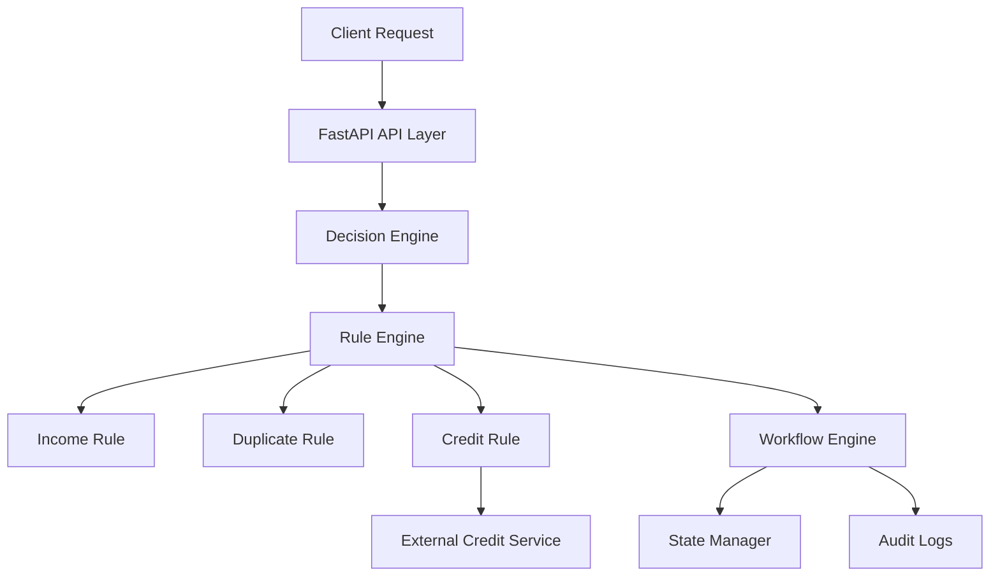

# 🚀 Configurable Workflow Decision Platform

A modular rule-based decision platform that processes requests using configurable workflows and business rules.

The system exposes a REST API that evaluates rules, interacts with external services, and determines a final decision through a workflow engine.

---

## ✨ Features

- REST API using FastAPI
- Modular rule engine
- Configurable workflow using JSON
- External dependency simulation
- Retry logic for external service failures
- Request state tracking
- Audit logging
- Test scenarios

---

## 🏗 System Architecture



---

## 🧩 Architecture Overview

The platform follows a modular architecture where each component has a specific responsibility.

### API Layer
Handles incoming HTTP requests using FastAPI.

### Decision Engine
Coordinates the entire decision process by invoking the rule engine and workflow engine.

### Rule Engine
Evaluates business rules sequentially.

Implemented rules:
- Income Rule
- Duplicate Rule
- Credit Rule

### External Services
A simulated credit scoring service represents an external dependency.

### Workflow Engine
Determines the final decision based on rule evaluation results.

Workflow behavior is configurable using JSON.

### State Manager
Tracks request states.

### Audit Manager
Logs system events such as rule evaluations and final decisions.

---
## ⚖ Design Trade-offs

To keep the implementation simple and suitable for demonstration, several design trade-offs were made:

- **In-memory state management** is used instead of a database to simplify setup.
- **Sequential rule evaluation** is used instead of parallel processing for clarity.
- **External services are simulated** rather than integrating real third-party APIs.
- **Workflow configuration is JSON-based**, which improves flexibility but may require validation in larger systems.

---

## 📌 Assumptions

The system design assumes:

- Each request contains a unique `request_id`.
- Rules return deterministic `PASS` or `FAIL` results.
- External service failures are temporary and can be retried.
- Workflow decisions are based on aggregated rule results.
- The system runs as a single service instance for this assignment.

---

## 🔄 Data Flow

1. Client sends a request to the REST API.
2. API forwards the request to the Decision Engine.
3. Decision Engine triggers the Rule Engine.
4. Rule Engine evaluates all rules.
5. Credit Rule interacts with the external credit service.
6. Rule results are sent to the Workflow Engine.
7. Workflow Engine determines the final decision.
8. State Manager records the request state.
9. Audit Manager logs system events.
10. The API returns the final decision to the client.

## 📂 Project Structure

```
workflow_decision_platform
│
├── api
│   └── request_api.py
│
├── engine
│   ├── decision_engine.py
│   ├── rule_engine.py
│   ├── workflow_engine.py
│   ├── state_manager.py
│   └── audit_manager.py
│
├── rules
│   ├── base_rule.py
│   ├── income_rule.py
│   ├── duplicate_rule.py
│   └── credit_rule.py
│
├── external
│   └── credit_service.py
│
├── config
│   └── workflow_config.json
│
├── storage
│   └── README.md
│
├── workflow
│   └── README.md
│
├── tests
│   └── test_requests.py
│
├── main.py
├── requirements.txt
└── README.md
```

---

## ⚙ Installation

Clone the repository

```
git clone https://github.com/Sawarnshivam/workflow-decision-platform.git
```

Navigate to project folder

```
cd workflow-decision-platform
```

Create virtual environment

```
python -m venv venv
```

Activate environment (Windows)

```
venv\Scripts\activate
```

Install dependencies

```
pip install -r requirements.txt
```

---

## ▶ Running the Application

Start the API server

```
uvicorn main:app --reload
```

Open interactive API documentation

```
http://127.0.0.1:8000/docs
```

---

## 🔗 API Endpoint

POST `/process_request`

Example request

```json
{
 "request_id": 10,
 "income": 75000,
 "is_duplicate": false
}
```

Example response

```json
{
 "request_id": 10,
 "decision": "APPROVE",
 "rules": [
   {"rule": "income_rule", "result": "PASS"},
   {"rule": "duplicate_rule", "result": "PASS"},
   {"rule": "credit_rule", "result": "PASS", "score": 645}
 ]
}
```

---

## 🔄 Workflow Configuration

Workflow logic is defined in

```
config/workflow_config.json
```

Example configuration

```json
{
  "workflow": {
    "start": "RULE_CHECK",
    "steps": {
      "RULE_CHECK": {
        "on_pass": "APPROVE",
        "on_fail": "REJECT"
      }
    }
  }
}
```

This allows workflow changes without modifying the application code.

---

## 🧪 Running Tests

Run test scenarios

```
python -m tests.test_requests
```

Test cases include

- Successful approval
- Low income rejection
- Duplicate request rejection
- External service failure handling

---

## 🛠 Technologies Used

| Technology | Purpose |
|------------|--------|
| Python | Core programming language |
| FastAPI | REST API framework |
| Pydantic | Request validation |
| Uvicorn | ASGI server |

---

## 📌 Use Cases

- Loan approval systems
- Insurance claim processing
- Fraud detection workflows
- Vendor onboarding pipelines
- Automated decision systems

---

## 👨‍💻 Author

Shivam Sawarn  
Configurable Workflow Decision Platform Assignment
